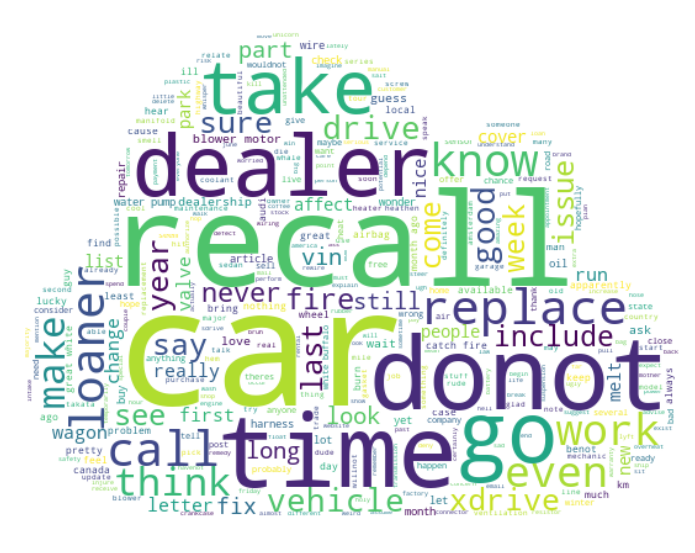
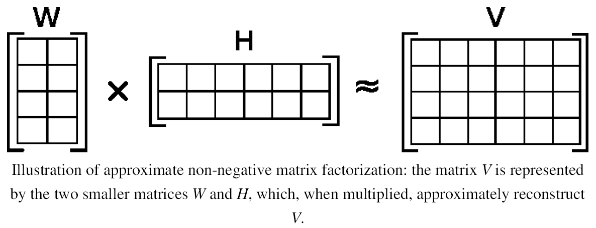
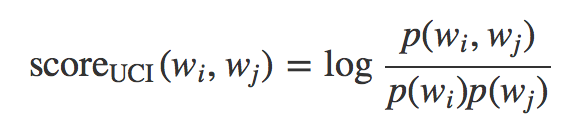
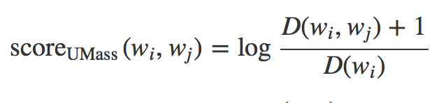
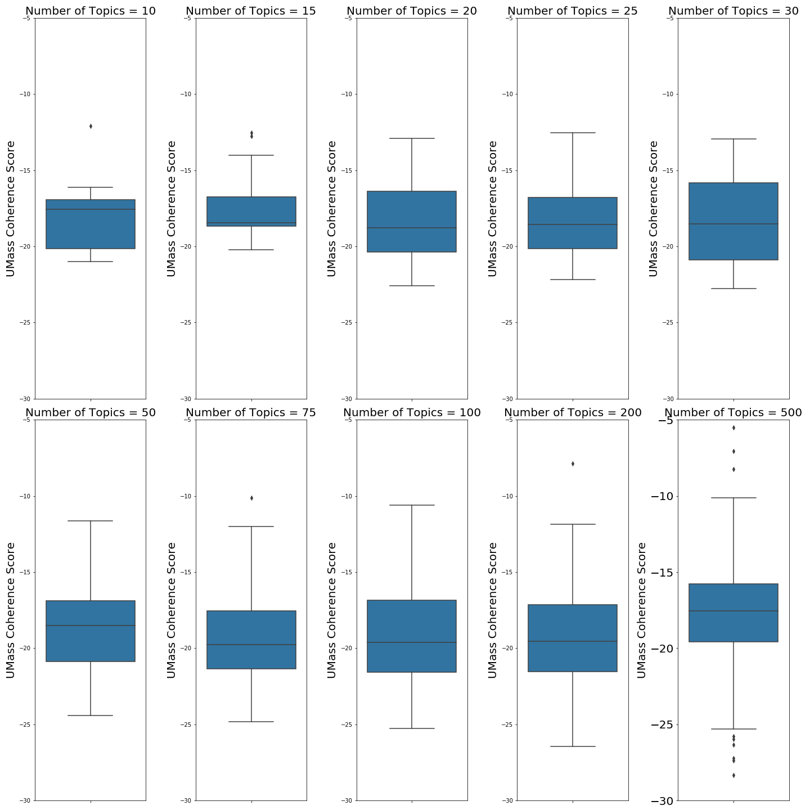

# Underlying topic exploration from 33 subreddits

### Question

*Is there a noticable difference between the general discussions occuring across different car brand subreddits?*


### Goals
> The goals of this capstone were to explore the underlying topics expressed in thread posts across 33 different car subreddits. Topic Modeling was completed across all subreddits and used to visualize any patterns in the discussions occuring across each subreddit. The end goal was to try to deduce if there was an apparent difference in the conversations happening between the different subreddits.

### Table of Contents:
> [Data](#data)<br>
> [Processing](#processing)<br>
> [Models](#models)<br>
> [Results](#results)<br>
> [Future Steps](#future-steps)<br>
> [References](#references)

                                                                                                              *[Top](#underlying-topic-exploration-from-33-subreddits)*
___

### Data
Using a Python Reddit API Wrapper ([PRAW](https://praw.readthedocs.io/en/latest/)), subreddit thread comments were scraped, resulting in approximately ~200,000 comments. Topic models were created to determine the general underlying topics being discussed by the community posting in each subreddit.

The following subreddits were compared:

* [r/BMW](https://www.reddit.com/r/BMW/)
* [r/Audi](https://www.reddit.com/r/Audi/)
* [r/Kia](https://www.reddit.com/r/Kia/)
* [r/Mercedes](https://www.reddit.com/r/Mercedes_Benz/)
* [r/Porsche](https://www.reddit.com/r/Porsche/)
* [r/Hyundai](https://www.reddit.com/r/Hyundai/)
* [r/Ford](https://www.reddit.com/r/Ford/)
* [r/Kia](https://www.reddit.com/r/Kia/)
* [r/Chevy](https://www.reddit.com/r/Chevy/)
* [r/Honda(& Acura)](https://www.reddit.com/r/Honda/)
* [r/Toyota](https://www.reddit.com/r/Toyota/)
* [r/TeslaMotors](https://www.reddit.com/r/TeslaMotors/)
* [r/Lexus](https://www.reddit.com/r/Lexus/)
* [r/Volvo](https://www.reddit.com/r/Volvo/)
* [r/Jeep](https://www.reddit.com/r/Jeep/)
* [r/Dodge](https://www.reddit.com/r/Dodge/)
* [r/Chrysler](https://www.reddit.com/r/Chrysler/)
* [r/Nissan](https://www.reddit.com/r/Nissan/)
* [r/Infiniti](https://www.reddit.com/r/Infiniti/)
* [r/Fiat](https://www.reddit.com/r/Fiat/)
* [r/Lamborghini](https://www.reddit.com/r/Lamborghini/)
* [r/Ferrari](https://www.reddit.com/r/Ferrari/)
* [r/AstonMartin](https://www.reddit.com/r/AstonMartin/)
* [r/Maserati](https://www.reddit.com/r/Maserati/)
* [r/Lotus](https://www.reddit.com/r/Lotus/)
* [r/Mitsubishi](https://www.reddit.com/r/Mitsubishi/)
* [r/Mclaren](https://www.reddit.com/r/Mclaren/)
* [r/GMC](https://www.reddit.com/r/GMC/)
* [r/Cadillac](https://www.reddit.com/r/Cadillac/)
* [r/Buick](https://www.reddit.com/r/Buick/)
* [r/Mazda](https://www.reddit.com/r/Mazda/)
* [r/RangeRover](https://www.reddit.com/r/RangeRover/)
* [r/Jaguar](https://www.reddit.com/r/Jaguar/)

                                                                                                              *[Top](#underlying-topic-exploration-from-33-subreddits)*
___

## Processing

All comments had stopwords removed to condense the large number of filler words that are present in nearly every single comment and lemmatized to transform all words to their contextual root form.

                                                                                                              *[Top](#underlying-topic-exploration-from-33-subreddits)*
___

## Models
Several techniques were utilized to best model underlying topics being discussed in the subreddits.


#### NMF
**Conceptualization:** Non-Negative Matrix Factorization (NMF) can be used for dimensionality reduction by approximating the values of a high-dimensional dataset. *Reconstruction error* is computed via the ***Frobenius norm*** and minimized. Conceptually the *Frobenius norm* is similar to the *Euclidean Distance*, generalized for matrices rather than vectors.


**Output:** NMF accomplishes dimensionality reduction by decomposing high dimensional data. This is done by creating a user-defined number of features, then two lower rank matrices are assembled that when multiplied *approximate* the original higher dimension data. NMF uses an iterative method to reduce reconstruction error.



Two methods to determine the optimal number of user-defined topics is to measure the reconstruction error and the Topic coherence. The Topic coherence score can be measure either by an extrinsic UCI measurement or an intrinsic UMass measurement.

| **Extrinisic UCI**  |  |
| ------------- | ------------- |
| **Intrinsic UMass**  |   |

The UMass score relates the coherence within a topic between words. Therefore a smaller number equates to a more coherent topic clsutering.


#### LDA
**Conceptualization:** Latent Dirichlet Allocation (LDA) models is a probablistic bag of words model. When training an LDA models, words in a corpus are assigned to one of *k* topics, randomly. Then, via ***Bayes' Rule***, computes the probabilities of each word being in each topic assuming all of the other words are in the correct topic, then updates the topic that word belongs in.

**Output:** LDA outputs a probability matrix of words vs topics. From this, topic interpretation can be performed by looking at the most probable words for each topic. Because the output is a probability matrix, which is a representation of soft clustering, LDA is typically better at topic modeling because it can better represent actual topics in documents as a single document may be about multiple topics.


                                                                                                              *[Top](#underlying-topic-exploration-from-33-subreddits)*
___

## Results


|  |
| ------------- |
|**Plot of BMW Reconstruction errors between NMF approximation matrix multiplication and original TDIDF matrix against number of topics.**<br><br> As the number of topics increases, the reconstruction error lowers, indicating that with higher numbers of topics, the approximation becomes better.|

|  |
| ------------- |
|**Plot of BMW Intrinsic UMass Coherence Scores against number of topics.**<br><br> As the number of topics changes, coherence scores can be used to describe how much coherence the words contained within each topic have. A smaller negative number indicates a larger coherence while a larger negative number indicates a more disordered grouping of words.|

>``` Looking at the above results, and for interpretability, selected 10 topics for all subreddits. ```
### LDA Topic Model Visualizations

| | | | | |
| ------------- | ------------- | ------------- | ------------- | ------------- |
| [Aston Martin](https://htmlpreview.github.io/?https://github.com/kadify/Subreddit-group-topic-modeling/blob/master/html/aston_martin.html) | [Audi](https://htmlpreview.github.io/?https://github.com/kadify/Subreddit-group-topic-modeling/blob/master/html/audi.html) | [BMW](https://htmlpreview.github.io/?https://github.com/kadify/Subreddit-group-topic-modeling/blob/master/html/bmw.html) | [Buick](https://htmlpreview.github.io/?https://github.com/kadify/Subreddit-group-topic-modeling/blob/master/html/buick.html) | [Cadillac](https://htmlpreview.github.io/?https://github.com/kadify/Subreddit-group-topic-modeling/blob/master/html/cadillac.html) |
| [Chevy](https://htmlpreview.github.io/?https://github.com/kadify/Subreddit-group-topic-modeling/blob/master/html/chevy.html) | [Chrysler](https://htmlpreview.github.io/?https://github.com/kadify/Subreddit-group-topic-modeling/blob/master/html/chrysler.html) | [Dodge](https://htmlpreview.github.io/?https://github.com/kadify/Subreddit-group-topic-modeling/blob/master/html/dodge.html) | [Ferrari](https://htmlpreview.github.io/?https://github.com/kadify/Subreddit-group-topic-modeling/blob/master/html/ferrari.html) | [Fiat](https://htmlpreview.github.io/?https://github.com/kadify/Subreddit-group-topic-modeling/blob/master/html/fiat.html) |
| [Ford](https://htmlpreview.github.io/?https://github.com/kadify/Subreddit-group-topic-modeling/blob/master/html/ford.html) | [GMC](https://htmlpreview.github.io/?https://github.com/kadify/Subreddit-group-topic-modeling/blob/master/html/gmc.html) | [Honda](https://htmlpreview.github.io/?https://github.com/kadify/Subreddit-group-topic-modeling/blob/master/html/honda.html) | [Hyundai](https://htmlpreview.github.io/?https://github.com/kadify/Subreddit-group-topic-modeling/blob/master/html/hyundai.html) | [Infiniti](https://htmlpreview.github.io/?https://github.com/kadify/Subreddit-group-topic-modeling/blob/master/html/infiniti.html) |
| [Jaguar](https://htmlpreview.github.io/?https://github.com/kadify/Subreddit-group-topic-modeling/blob/master/html/jaguar.html) | [Jeep](https://htmlpreview.github.io/?https://github.com/kadify/Subreddit-group-topic-modeling/blob/master/html/jeep.html) | [Kia](https://htmlpreview.github.io/?https://github.com/kadify/Subreddit-group-topic-modeling/blob/master/html/kia.html) | [Lamborghini](https://htmlpreview.github.io/?https://github.com/kadify/Subreddit-group-topic-modeling/blob/master/html/lamborghini.html) | [Lexus](https://htmlpreview.github.io/?https://github.com/kadify/Subreddit-group-topic-modeling/blob/master/html/lexus.html) |
| [Lotus](https://htmlpreview.github.io/?https://github.com/kadify/Subreddit-group-topic-modeling/blob/master/html/lotus.html) | [Maserati](https://htmlpreview.github.io/?https://github.com/kadify/Subreddit-group-topic-modeling/blob/master/html/maserati.html) | [Mazda](https://htmlpreview.github.io/?https://github.com/kadify/Subreddit-group-topic-modeling/blob/master/html/mazda.html) | [Mclaren](https://htmlpreview.github.io/?https://github.com/kadify/Subreddit-group-topic-modeling/blob/master/html/mclaren.html) | [Mercedes Benz](https://htmlpreview.github.io/?https://github.com/kadify/Subreddit-group-topic-modeling/blob/master/html/mercedes.html) |
| [Mitsubishi](https://htmlpreview.github.io/?https://github.com/kadify/Subreddit-group-topic-modeling/blob/master/html/mitsubishi.html) | [Nissan](https://htmlpreview.github.io/?https://github.com/kadify/Subreddit-group-topic-modeling/blob/master/html/nissan.html) | [Porsche](https://htmlpreview.github.io/?https://github.com/kadify/Subreddit-group-topic-modeling/blob/master/html/porsche.html) | [Land Rover](https://htmlpreview.github.io/?https://github.com/kadify/Subreddit-group-topic-modeling/blob/master/html/range_rover.html) | [Tesla](https://htmlpreview.github.io/?https://github.com/kadify/Subreddit-group-topic-modeling/blob/master/html/tesla.html) |
| [Toyota](https://htmlpreview.github.io/?https://github.com/kadify/Subreddit-group-topic-modeling/blob/master/html/toyota.html) | [Volvo](https://htmlpreview.github.io/?https://github.com/kadify/Subreddit-group-topic-modeling/blob/master/html/volvo.html) |   |   |   |
|   |   |   |   |   |


Generalizing what the topics seemed to be based on what words were in that topic showed that for the most part there do seem to be some slight trends in the discussions on the different threads. In more sporting or luxury focused vehicle subreddits, often times there were clear threads with "pic thread" vernacular. This is to say, a lot of slang, compliments, pic requests/mentioning of particular exterior aesthetic features, etc.

A few brands had unique discussions. For example, in the kia subreddit, there was a topic that seemed to be focused entirely on interior discussions. In the Tesla subreddit, there were obviously differing conversations because the cars are electric and therefore there were topics that focused on batteries and charging, ordering the cars (since there are no dealerships), and autopilot. Among the supercar subreddits, there were a lot of comparison threads however the topics didn't seem to be fully separated. Certain descriptive terms were frequently in multiple topics. More iterations would help fully extract the true topics for these sorts of subreddits.


                                                                                                              *[Top](#underlying-topic-exploration-from-33-subreddits)*
___

## Future steps
1. Compute cosine similarity between topic top words for each subreddit to get a true measurement of how similar the discussions are between the different subreddits.


                                                                                                              *[Top](#underlying-topic-exploration-from-33-subreddits)*
___
## References
```
2. “Complete Guide to Topic Modeling.” NLP-FOR-HACKERS, 6 Feb. 2018,
    nlpforhackers.io/topic-modeling/.
2. McCallum, Andrew Kachites.  "MALLET: A Machine Learning for Language Toolkit."
    http://mallet.cs.umass.edu. 2002.
3. Pleplé , Quentin. Topic Coherence To Evaluate Topic Models, May 2013,
    qpleple.com/topic-coherence-to-evaluate-topic-models/.
4. Stern, Jordan. “Belief_Revision_on_Twitter.” GitHub,
    github.com/jordanstern1/Belief_Revision_on_Twitter.
```
